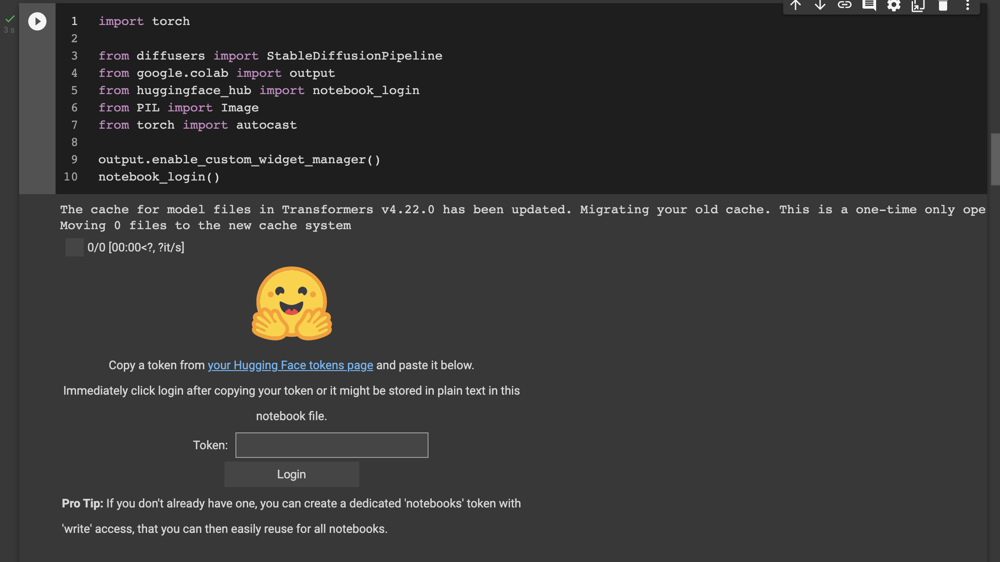
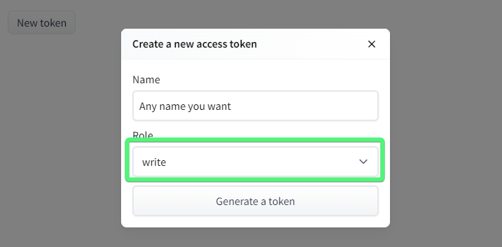
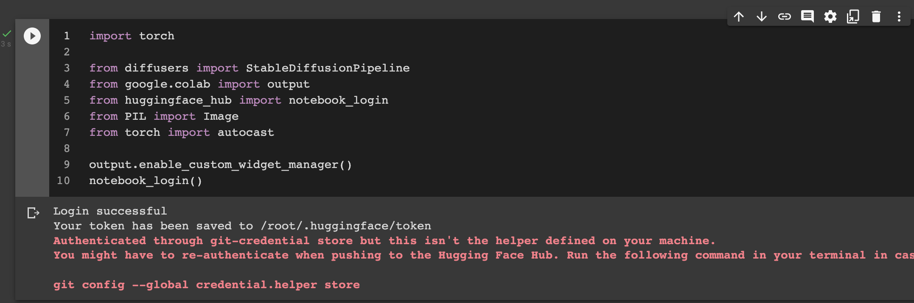

# README

Stable Diffusion is a state of the art text-to-image model that generates images from textual description. This Colab Notebook shows how to generate Harry Potter characters representations starting from their description in the novels.

## Setup

In order to run this Colab Notebook you to accomplish some preparatory tasks.

### Create a Hugging Face account

To download the model from Hugging Face you'll need an account. If you don't already have one, the process is very simple. Just visit their [website](https://huggingface.co/join) and create an account as you do every time and verify the provided email address.

### Check Runtime Type
To run the model you have to use a GPU Runime on Colab. To check this, in the menu go to **Runtime > Change** runtime type and select GPU if it's not.

### Hugging Face Login
By clicking play on the second cell you'll achieve the following interface:

Here you have to put your Hugging Face token. To achieve the token click on the link **your Hugging Face tokens page** then click on **New token** button and you should see a modal window where you can set a name (it’s just for reference, use any name you want, e.g. *notebooks*), and set the Role to write. 

Finally click **Generate a token**. Now your token should be created and you can use it into the Colab interface. Once you clicked on the Login button the interface will change as follow:

### Run your imagination
Now you can run the other cells to reproduce our results or use the last one to generate new images starting from your descriptions.
